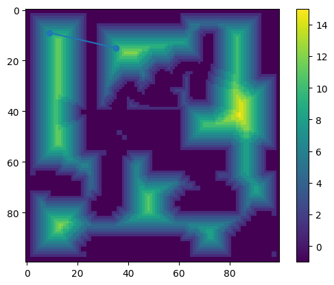

# Sistema FSD


## Distance transform
Como já se sabe o resolvedor de mapa(Path finder) tenta sempre encontrar o caminho mais perto. Isto cria um problema.

Aqui está o resultado do path finder após ser fornecido o mapa:\
\
Como podemos observar, o algoritmo encontrou o caminho mais perto, embora temos de ter em consideração que o robô não pode andar extremamente perto das paredes. Mas porquê? 

O lidar(que fornece a posição do robô) está no centro do robô. Se o algoritmo vê que a posição atual do Lidar não for a do ponto currente, ele tenta navegar para lá.
Como o robô têm estrutura física de lado(rodas, etc), fisicamente o robô vai estar a se esbarrar na parede enquanto o algoritmo tenta por a sua posição currente(fornecida pelo o lidar) no ponto objetivo.

Ou seja, temos de fazer o robô **não se esbarre nas paredes**.\
Para isso podemos criar esta regra para o path finder:\
`O robô têm de estar o mais longe possivel das paredes.`

Mas como fazemos isto? Aqui é onde entra o distance transform.\
\
Como podemos observar, temos uma mapa onde o mais escuro, o pior(less likely) o robô tem de ir.

Agora vêm a parte onde combinamos esta tranformação e o algoritmo. 
O algorimo usa uma função de perda, onde a perda maior, pior o caminho. Em vez de fazer um algoritmo que encontra o melhor caminho baseado só na **distância**, fazemos com que o algoritmo tenha em conta a **distância** e o **valor da célula**. Nós subtraimos da distância o valor da célula, e o algortimo cria um melhor caminho.\
Vamos observar o nosso novo caminho:\
\
Wow! Como podemos observar, o algoritmo fez com que o robô fosse numa distância apropriada entre as paredes, sem esbarrar nela! Incrivel! 

## Demasiados pontos!
Como vimos á pouco, temos um mapa onde o robô não se esbarra nas paredes. Como já se sabe, a função `IrParaPonto` precisa de apenas uma posição. Esta função faz com que o robô vire-se para o ponto se for preciso (`RodarParaGrau`) e depois vai continuamente dando velocidade para os motores(e direção), abrandado se estiver mais perto do ponto (`NavegarParaPonto`).

**Mas que nos interessa por o robô por em uma linha reta se nós queremos com que o robô siga o caminho que o Path Finder deu?**\
Simples. Para todos os pontos que o Path Finder nos deu, nós chama-mos `IrParaPonto` com o argumento `ModoContinuo=true`(Para que ele não trave quando acabar esse ponto).

**Agora vêm o problema**\
Como já vimos á pouco, o path finder dá muitos pontos(237). Isto resulta o robô tente ir exatamente nesse ponto, que faz com que o robô abrande e gire para a posição do proximo ponto(a distância é muito pequena).

**Como podemos resolver isto?**
Se lembrar-mos no caminho que o Path Finder nos deu, Alguns caminhos apenas são linhas. Podemos fazer com que pomos pontos apenas nos vértices do caminho, assim ele pode ir mais rápido e não trava-arranca.\
Eu eventualmente numa tarde de biblioteca cozinho este terror. (Sim, eu sei que pode ser melhorado, mas funciona)
```csharp
    /// <summary>
    /// Faz o tratamento dos pontos para se obter uma linha reta. Ver docs.
    /// </summary>
    /// <param name="pontos"></param>
    /// <returns></returns>
    private List<Point> FazerTratamentoPontos(List<Point> pontos)
    {
        double aX = 0;
        double bX = 0;

        double aY = 0;
        double bY = 0;


        var pontosSaida = new List<Point>();
        for (int i = 0; i < pontos.Count - 1; i += 1)
        {
            var pontoCurr = pontos[i];
            var pontoProx = pontos[i + 1];

            double x = i;
            double y = pontoProx.X;
            if (aX * x + bX != y)
            {
                pontosSaida.Add(pontoCurr);
                aX = (pontoCurr.X - pontoProx.X) / (x - (x + 1.0));//y por x
                bX = y - aX * x;
            }

            x = i;
            y = pontoProx.Y;
            if ((aY * x + bY) != y)
            {
                pontosSaida.Add(pontoCurr);
                aY = (pontoCurr.Y - pontoProx.Y) / (x - (x + 1.0));//#y por x
                bY = y - aY * x;
            }
        }
        pontosSaida.RemoveAt(0);//Remover o primeiro ponto
        return pontosSaida;
    }
```
Estás a ver bem! `f(x) = ax + b` É a nossa função amada que aprendemos no 9º/10º ano. Afinal valeu apena aprender não foi? Este código praticamente faz com que ele tente advinha o próximo ponto. Se o que advinhou não foi a posição do próximo ponto, então adicionamos esse ponto e alteramos o `a` e o `b`.\
Vamos ver os resultados:\
\
Agora temos apenas **50 pontos**! Agora apenas chama-mos `IrParaPonto` com o `ModoContinuo=true` para todos os pontos. 

## Tcharan!
Acabamos de fazer o sistema todo de FSD! Sim, ainda falta algumas coisas como tentar não ir contra pessoas e também recriar e detetar caso o caminho criado fique obstruido. Mas isso para já não interessa!  
    